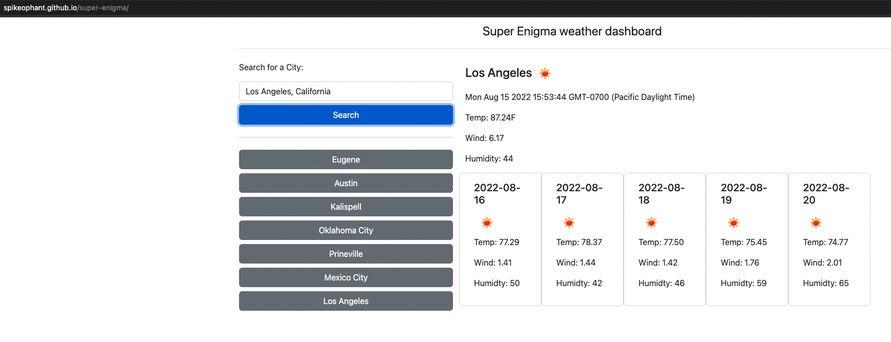

# Super Enigma - A personal Weather Dashboard

## Description

A quick, easy to use, weather dashboard.  Only displays current, and 5-Day forecast.  Mostly responsive layout.  Very
nice change of pace from wunderground and similar slow to load sites.  Available at [https://spikeophant.github.io/super-enigma/](https://spikeophant.github.io/super-enigma/)
A couple minor graphical issues that could be worked out with time.

## Installation

No installation required!  If you want to run locally clone main and use your favorite IDE to view the project, then open in browser.
Or point your favorite browser to the locally cloned repo's index.html

## Usage

Available at [here](https://spikeophant.github.io/super-enigma/)

## Credits

@spikeophant

